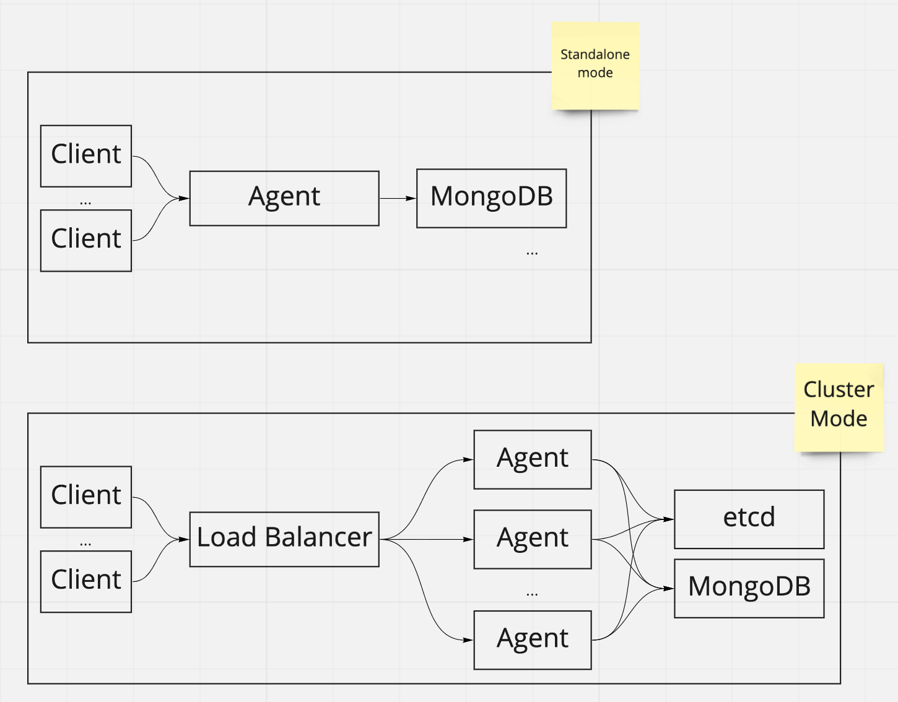
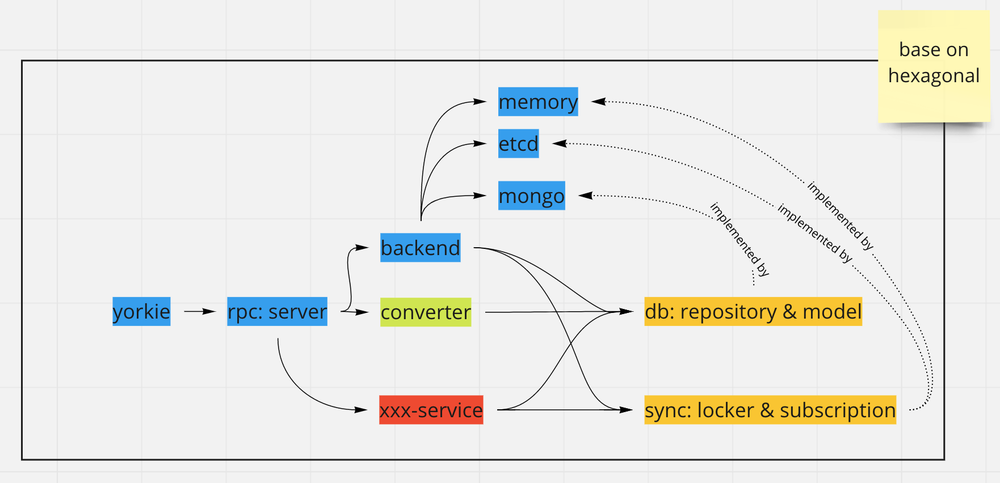

# Cluster Mode

## Summary

In a production environment, it is generally expected more than one agent to handle client's requests. Even if an agent goes down, the other agents must be able to handle the request. To support this scenario, agents must be able to increase or decrease easily in the cluster. Yorkie provides a cluster mode in which multiple agents can run by moving agent's local state to a remote location.

### Goals

Provide cluster mode when the user sets the etcd configuration. The local states to be moved to remote are as follows:
- Locker Map: A Map of Locker used to maintain consistency of metadata of the documents such as checkpoints when modifying documents.
- Subscription Map: A Map of subscription used to deliver events to other peers when an event such as a document change occurs.

If the user does not set etcd configuration, agent runs in the standalone mode as before.

### Architecture

The interfaces of Locker Map and Subscription Map are defined in the `yorkie/backend/sync` package and implemented based on memory in the `yorkie/backend/sync/memory`.

